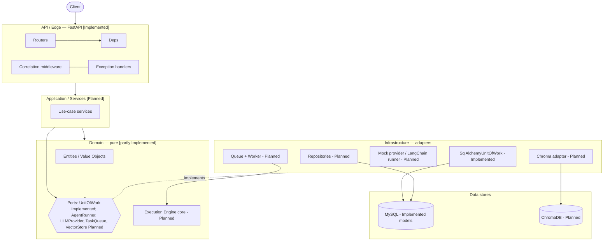
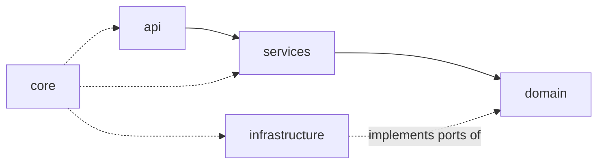
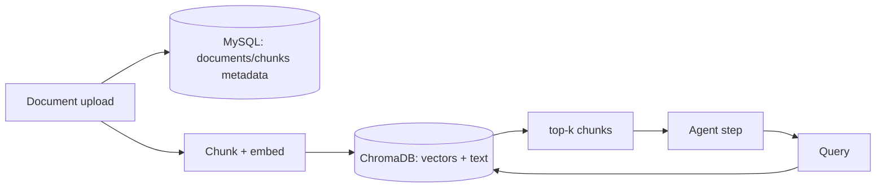

# Architecture

> **Status legend used across all docs:** **[Implemented]** exists in code today · **[Planned]** designed & approved, scheduled for a specific phase · **[Future]** post-V1, direction agreed but not yet designed in detail.

This is the hub document. It describes the shape of the system and links out to the specialised docs:
[database.md](database.md) · [execution-engine.md](execution-engine.md) · [langchain.md](langchain.md) · [decisions.md](decisions.md) · [roadmap.md](roadmap.md) · [coding-standards.md](coding-standards.md) · [development-guide.md](development-guide.md) · [glossary.md](glossary.md).

---

## 1. Project vision

Orqent is a backend platform for building and running **multi-agent AI workflows**. A user defines agents (an LLM configuration + prompt), composes them into a workflow, and runs that workflow; the platform executes the agents in order, passes data between them, and records a durable, inspectable history of every run.

The guiding principle is that **the workflow runtime is the product, and the web framework and the LLM library are replaceable details**. Orqent owns orchestration, persistence, and history; FastAPI is a thin HTTP edge, and LangChain is confined to a single adapter. See [decisions.md](decisions.md) for the reasoning behind every major choice referenced here (cited as `ADR-n`).

---

## 2. Overall architecture

Orqent is a **layered architecture** with a **hexagonal (ports & adapters) core** for the two things that must never couple to a vendor or framework: the execution engine and the LLM integration.



---

## 3. Layered architecture

Each layer has one responsibility and a strict set of allowed dependencies. The **dependency rule** (below) is what keeps them honest.

| Layer | Package | Responsibility | Status |
|-------|---------|----------------|--------|
| API / Edge | `app.api` | HTTP↔app translation, routing, auth entry, error mapping, correlation | **[Implemented]** |
| Application / Services | `app.services` | One method per use case; owns the transaction; enforces ownership | **[Planned]** (Phase 4+) |
| Domain | `app.domain` | Entities, value objects, **ports**, execution engine core — pure Python | **[Partly Implemented]** (errors, UnitOfWork port) |
| Infrastructure | `app.infrastructure` | Adapters: repositories, DB, LLM/agent runner, vector store, queue, worker, security | **[Partly Implemented]** (DB infra) |
| Data | MySQL, ChromaDB | Source-of-truth relational state; derived vector index | **[Partly Implemented]** (MySQL models) |
| Cross-cutting | `app.core` | Config, logging, correlation, constants | **[Implemented]** |
| Composition root | `app.container` | Wires abstractions to concretions | **[Implemented]** |

Per-layer "what must never go here" rules live in [coding-standards.md](coding-standards.md#layer-rules).

---

## 4. Ports and adapters

A **port** is an abstract interface defined in `app.domain.ports`; an **adapter** is a concrete implementation in `app.infrastructure`. The domain depends only on ports, so any adapter can be swapped without touching business logic.

| Port | Purpose | Adapter(s) | Status |
|------|---------|-----------|--------|
| `UnitOfWork` | Transaction boundary | `SqlAlchemyUnitOfWork` | **[Implemented]** |
| `LLMProvider` | Raw model call (normalized) | `MockLLMProvider` → real providers | **[Planned]** |
| `AgentRunner` | Execute one agent step | `LangChainAgentRunner` (and a mock) | **[Planned]** — see [langchain.md](langchain.md) |
| `TaskQueue` | Durable async hand-off | in-process DB-backed → Celery | **[Planned]** |
| `VectorStore` | Vector upsert/query | Chroma adapter | **[Planned]** |

---

## 5. Dependency rule

**Dependencies point inward. The domain depends on nothing outward.**



Concretely:
- `app.domain` must not import `app.api`, `app.services`, `app.infrastructure`, FastAPI, SQLAlchemy, LangChain, or any driver.
- `app.services` must not import FastAPI request/response objects or vendor SDKs.
- Only `app.infrastructure` imports SQLAlchemy, drivers, LangChain, Chroma.
- Only `app.container` knows which concrete class implements which port.

This rule is currently upheld by convention and review; **[Future]** an `import-linter` contract in CI will enforce it mechanically (see [roadmap.md](roadmap.md#recommended-improvements) and [decisions.md](decisions.md)).

---

## 6. FastAPI architecture **[Implemented]**

The HTTP edge is deliberately thin.

- **Application factory** — `app.main.create_app(settings)` configures logging, builds the [`Container`](#8-dependency-injection-container-implemented), attaches it to `app.state`, registers middleware, exception handlers, and routers, and returns a `FastAPI`. A module-level `app` exists for `uvicorn app.main:app`. The factory form lets tests build isolated apps with overridden settings.
- **Dependencies** (`app.api.deps`) are the seam to the container: `ContainerDep`, `SettingsDep`, and `SessionDep` are `Annotated[..., Depends(...)]` aliases; routers declare them and stay ignorant of construction.
- **Correlation middleware** (`app.api.middleware.CorrelationIdMiddleware`) honours an inbound `X-Correlation-ID` or mints one, binds it to the logging context, and echoes it on the response.
- **Exception handlers** (`app.api.errors`) map the domain error hierarchy to a single `ErrorResponse` envelope. See [coding-standards.md](coding-standards.md#error-handling-philosophy).
- **Routers** — health (`/health/live`, `/health/ready`) is mounted unversioned at the root for orchestrator probes; the versioned business API mounts at `settings.api_v1_prefix` (`/api/v1`) via `app.api.v1.router.api_v1_router` (currently an empty aggregation point awaiting feature routers).

### Request flow (synchronous, current)
```
HTTP → Router → Deps (settings/session) → [Service → UnitOfWork → Repository]  (Planned)
     → response model → JSON
```
The bracketed section is Planned; today only health routes exist.

---

## 7. SQLAlchemy infrastructure & async design **[Implemented]**

Detailed in [database.md](database.md); summarised here as it's core to the architecture.

- **Async throughout** (`ADR-001`). The engine (`create_engine`), session factory (`create_session_factory`, `expire_on_commit=False`), and Unit of Work are all async. The engine is **lazy** — built on first access in the `Container`, so importing the app opens no connection.
- **Declarative base** (`app.infrastructure.db.base.Base`) carries a `MetaData` with a fixed **naming convention** (`ADR-006`) so every constraint/index is named deterministically for stable migrations.
- **Mixins** (`app.infrastructure.db.mixins`) provide single-concern columns: `CreatedAtMixin`, `TimestampMixin`, `PublicIdMixin` (ULID, `ADR-004`), `TenantMixin` (`organization_id` FK), plus `big_int_pk` / `big_int_fk` helpers.
- **Unit of Work** — the transaction boundary; abstract port in the domain, `SqlAlchemyUnitOfWork` adapter in infrastructure. See [§9](#9-unit-of-work-implemented).

---

## 8. Dependency injection container **[Implemented]**

`app.container.Container` is the composition root. It holds `Settings` and lazily builds the async `engine` and `session_factory`, exposes a `unit_of_work()` factory, and `dispose()`s the pool on shutdown. It is the only place that maps abstractions to concrete classes; as services/repositories arrive, they are wired here without changing call sites.

---

## 9. Unit of Work **[Implemented]**

The `UnitOfWork` port (`app.domain.ports.unit_of_work`) defines the transaction lifecycle with no SQLAlchemy: an async context manager plus `commit()` / `rollback()`, where exit rolls back anything not explicitly committed. `SqlAlchemyUnitOfWork` implements it over an `AsyncSession`, exposing `.session` for future repositories to bind to. Services (Planned) will obtain a UoW from the container for write use cases; the plain `SessionDep` is for read paths. See [decisions.md](decisions.md) (`ADR-009`).

---

## 10. Repository pattern **[Planned]**

Repositories will be the **only** code that talks to MySQL, one per aggregate, returning ORM models (used as anemic data carriers, `ADR-008`) and scoping every query by `organization_id`. They attach to the Unit of Work. None exist yet — they arrive with the features that need them (Phase 4+). Rules in [coding-standards.md](coding-standards.md#repositories-planned).

---

## 11. Execution architecture **[Planned]**

Full detail in [execution-engine.md](execution-engine.md). In brief: an HTTP trigger creates an `Execution` row and enqueues its id (returning `202`); a worker dequeues, and the **framework-free execution engine** runs the workflow's nodes in order via the `AgentRunner` port, persisting each step. V1 is **linear** (`ADR-007`); DAG/branching is **[Future]**.

---

## 12. Memory & vector store architecture **[Planned]**

Long-term memory uses **ChromaDB** (`ADR-003`) purely as a **derived, rebuildable index**:
- MySQL is the source of truth for document and chunk **metadata** (`documents`, `document_chunks` — see [database.md](database.md)); raw bytes live in object storage; **vectors + chunk text live in Chroma**.
- Retrieval: `MemoryService` → `Embedder` port → `VectorStore` port → top-k chunks, always tenant-filtered.
- Nothing that is a source of truth, and no secrets/PII-as-keys, ever live in Chroma.



---

## 13. Planned authentication flow **[Planned]**

JWT access token + rotating refresh token with a server-side store (`ADR-010`; tables in [database.md](database.md)).

```mermaid
sequenceDiagram
    actor U as User
    participant API as FastAPI
    participant AS as AuthService
    participant DB as MySQL
    U->>API: POST /auth/login {email, password}
    API->>AS: authenticate(...)
    AS->>DB: verify user (Argon2id)
    AS->>DB: store hashed refresh token (refresh_tokens)
    AS-->>API: access JWT (short) + refresh (opaque)
    API-->>U: tokens
    U->>API: request + Bearer access JWT (stateless verify)
    U->>API: POST /auth/refresh (rotate; reuse of revoked token → revoke family)
```

---

## 14. Cross-cutting concerns

- **Configuration** — one validated `Settings` object; env-driven (`APP_` prefix); no scattered `os.getenv`. **[Implemented]**
- **Logging** — structured (structlog), correlated, JSON in prod. Philosophy in [coding-standards.md](coding-standards.md#logging-philosophy). **[Implemented]**
- **Error handling** — domain exception hierarchy → single envelope. Philosophy in [coding-standards.md](coding-standards.md#error-handling-philosophy). **[Implemented]**
- **Testing** — pyramid; philosophy in [coding-standards.md](coding-standards.md#testing-philosophy); how-to in [development-guide.md](development-guide.md). **[Implemented for current scope]**

---

## Cross-references
- Why each choice: [decisions.md](decisions.md)
- What's built vs pending: [roadmap.md](roadmap.md)
- Schema & migrations: [database.md](database.md)
- Engine & workflow lifecycle: [execution-engine.md](execution-engine.md)
- LangChain isolation: [langchain.md](langchain.md)
- Terms: [glossary.md](glossary.md)
