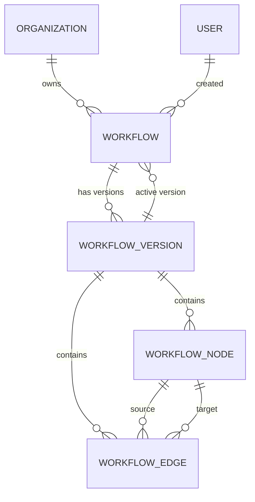
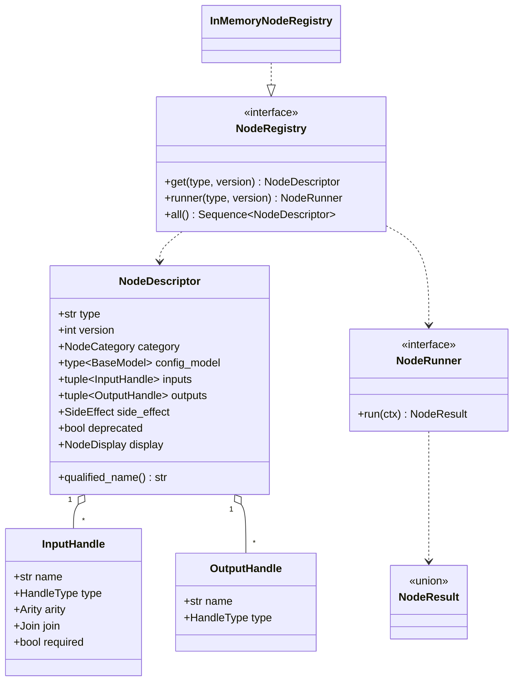
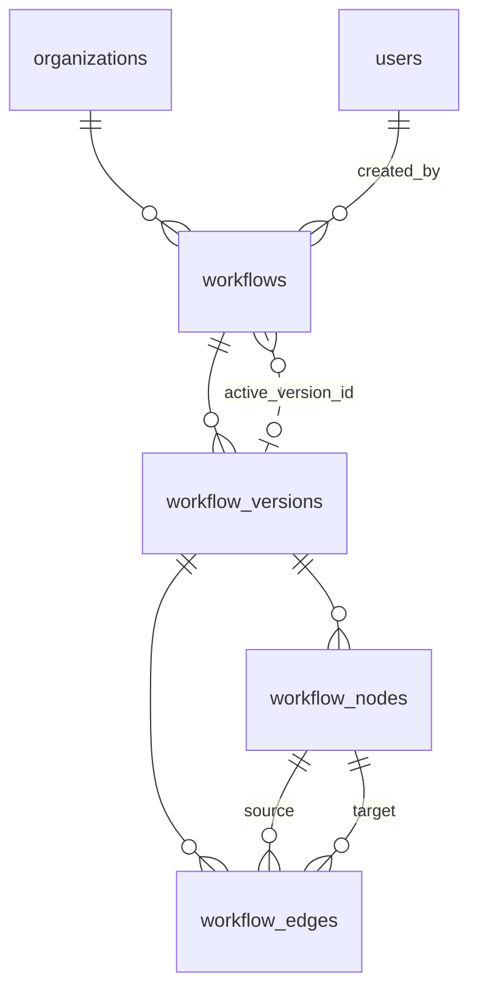

# Phase 4 — Implementation Specification

**Workflow authoring + node contract** · **Status: FROZEN** · 2026-07-29
Derives from the v2 architecture redesign (ADR-018 … ADR-030).
**No execution in this phase.**

> All ten review changes were accepted, together with three additional
> decisions (§1.6). This specification is settled: implementation begins at
> Milestone 1 (§12). Changes from here require an explicit amendment.

---

## 1. Validating the architecture

I wrote the v2 redesign; this section is where I argued with it. Ten changes
were proposed and **all ten were accepted**, along with three further decisions
recorded in §1.6. The findings are kept below because the *reasoning* is what a
future reader needs — a decision without its rejected alternative is folklore.

### 1.1 Inconsistencies found

**(a) The scope forest has nothing to do in Phase 4.** §5 of the redesign puts
`workflow_nodes.parent_node_id` in the schema so `Loop` can own a body. But
`Loop` arrives in Phase 6. Shipping the column now means a column that is always
NULL, validation that never fires, and a direct violation of the project's own
rule against scaffolding future phases (`CLAUDE.md`).

> **Change 1 — drop `parent_node_id` from Phase 4.** Add it in Phase 6 with the
> `Loop` node. Adding a nullable column to the end of a table is an instant DDL
> operation in MySQL 8; the migration is trivial and the discipline is worth
> more. Phase 4 keeps `node_key` unique *per version* (not per parent), which is
> already forward-compatible with scopes.

**(b) `Transform` cannot be a Phase 4 stub node.** The redesign's roadmap lists
"Manual Trigger, Transform, NoOp" as the three stubs — but `Transform` means
evaluating expressions over upstream data, and the expression language is listed
as an *open question* in the same document. The stub set contradicts itself.

> **Change 2 — replace the stub set with four nodes chosen to exercise every
> validation rule** (§5.7). None of them needs expressions.

**(c) "A small closed type lattice" and "structural `Record<A> → Record<B>`
subtyping" are not the same claim.** ADR-021 argues for a closed lattice on the
grounds that structural subsumption is unexplainable, then specifies structural
comparison for records. That is the thing it just rejected, one level shallower.

> **Change 3 — for Phase 4, `Record` compatibility is nominal:** same model, or
> the target is `Json`/`Any`. Structural field comparison is deferred until real
> nodes need it, at which point it can be added behind the same function with no
> API change. Nothing in Phase 4's node set needs it.

### 1.2 Missing — and the gap that matters most

**(d) There is no concurrency control on draft editing.** This is the serious
omission. A drag-and-drop builder autosaves; two tabs, or one tab with a slow
network and a retry, silently overwrite each other. The redesign specifies
`PUT /workflows/{id}/draft` with no version guard at all.

> **Change 4 — add `workflow_versions.revision`**, an integer bumped on every
> draft write. The client sends the revision it read; a mismatch returns **409
> Conflict**. Without this, the very first real user of the builder loses work
> and we will not be able to reproduce it.

**(e) No authorship or soft delete on workflows.** Every other owned table in
this codebase has `deleted_at`; `users` has soft delete and `organizations` has
timestamps. Workflows having neither is an inconsistency, not a simplification.

> **Change 5 — add `created_by_user_id`, `deleted_at`, and soft-delete-aware
> uniqueness on `(organization_id, name)`** using the ADR-005 generated-column
> pattern. ADR-005's own text anticipates exactly this generalisation.

**(f) The publish/draft transition is ambiguous.** "Publishing freezes it and
creates the next draft on next edit" leaves open whether publish copies the
draft into a new row or promotes the draft row in place.

> **Change 6 — publish promotes the draft row in place** (status `DRAFT →
> PUBLISHED`, assign `version_no`, stamp `published_at`, point
> `workflows.active_version_id` at it). A new draft is created **copy-on-write
> from the active version on the next edit**. Two properties fall out for free:
> the published version is byte-identical to what was validated (no copy step
> that could differ), and *"a draft row exists"* is precisely *"there are
> unpublished changes"* — a flag the builder needs and would otherwise have to
> compute by diffing.

**(g) Pydantic in the domain is an unacknowledged precedent.** `app/domain/` is
currently **stdlib-only** — verified. Node config models are Pydantic, and
`NodeDescriptor` must reference them.

> **Change 7 — add ADR-031 permitting Pydantic in the domain, scoped to node
> contracts.** The dependency rule exists to keep the domain free of I/O,
> frameworks, and swappable vendors; Pydantic is a pure data-shape library and
> the project's canonical one. The alternative — hand-rolling schema description
> and validation — is strictly worse. But it should be a *decision*, not a
> drift, because it is the first crack in a rule that has held for three phases.

**(h) Also missing, minor:** pagination policy; what `active_version_id` is
before the first publish (NULL); whether the catalog exposes deprecated node
types (yes, with a flag, so the builder can grey them out).

### 1.3 Overengineered for an MVP

| Item | Verdict |
|---|---|
| `GET /versions/{a}/diff/{b}` | **Cut from Phase 4.** Nice demo, zero dependants, non-trivial to do well. |
| Structural `Record` subtyping | **Cut** (Change 3). |
| Scope forest | **Cut** (Change 1). |
| `ui_position` as free-form JSON | **Keep.** It is presentation data in a domain table, which is impure — but there is nowhere better, the builder needs it persisted, and a published version that renders correctly is worth the impurity. Deliberate. |

### 1.4 What will become difficult later

1. **`node_type` is a string with no FK (ADR-022).** Correct for now, but the
   day a node type is renamed, published workflows break with no database error
   to warn us. Mitigation: **the registry is append-only** — types and versions
   are never renamed or removed, only deprecated — plus a startup check
   asserting every referenced type resolves. Write the append-only rule down in
   Phase 4 while there is nothing to migrate.
2. **Whole-graph `PUT` will not scale to very large workflows.** For tens of
   nodes it is by far the simplest correct design and matches how a canvas holds
   state. If graphs reach thousands of nodes, granular operations become
   necessary — but that is a real signal, not a prediction to build for now.
3. **Validation runs in the request path.** It is O(V+E) over a small graph, so
   fine. It becomes a problem only if validation ever needs I/O (e.g. checking
   that a connection exists) — at which point it must move behind a port rather
   than reaching for a session.

### 1.5 Accepted changes

All accepted 2026-07-29.

| # | Change | Why it matters |
|---|---|---|
| 1 | Drop `parent_node_id` until Phase 6 | Phase discipline; dead column otherwise |
| 2 | New four-node stub set | Current set requires unbuilt expressions |
| 3 | Nominal `Record` compatibility in Phase 4 | Resolves ADR-021's internal contradiction |
| 4 | **`revision` optimistic locking** | **Autosave silently loses work without it** |
| 5 | `created_by_user_id`, `deleted_at`, name uniqueness | Consistency with every other table |
| 6 | Publish promotes draft in place; draft is copy-on-write | Removes ambiguity; gives "has unpublished changes" free |
| 7 | ADR-031 — Pydantic permitted in domain | First break in a three-phase-old rule |
| 8 | Reserve expression syntax, build nothing | Keeps Phase 4 closed |
| 9 | Cut version diff | Scope |
| 10 | `ValidationReport` is a 200 response, not an error | Validating is a query, not a failure |

### 1.6 Additional decisions

**(i) Publishing is permitted to the workflow's creator or an organization
administrator.** "Organization administrator" maps to the seeded roles `owner`
and `admin` (migration `0003`).

This is the decision with the longest reach in the whole set, because it is the
project's **first resource-dependent authorization rule**. Every rule so far has
been answerable from the token alone — `require_roles` reads
`AuthenticatedUser.roles` and never touches storage. "The creator may publish"
cannot be: it depends on *which* workflow.

Three consequences follow, and none of them is optional:

1. **Publish authorization moves into `WorkflowService`, not a route dependency.**
   The route can still require authentication, but the decision needs the
   resource loaded. A `require_roles("owner", "admin")` on the publish route
   would be wrong — it would lock out the creator, which is the opposite of the
   intent.
2. **`AuthenticatedUser` carries `public_id` (a ULID); `workflows.created_by_user_id`
   is an internal BIGINT.** They cannot be compared directly. `WorkflowRepository.
   get_by_public_id` therefore **eager-loads the creator relationship**, so the
   service compares `workflow.creator.public_id == current_user.public_id` with
   no additional query — the same `joinedload` pattern `UserRepository` already
   uses for organization and roles.
3. **`created_by_user_id` is nullable** (`ON DELETE SET NULL`). If it is ever
   NULL the creator branch simply cannot match and only administrators may
   publish, which is the correct failure direction. In practice users are
   soft-deleted, so the FK effectively never fires.

This warrants **ADR-032 — resource-dependent authorization lives in the service
layer**, because the same shape recurs for every resource in Phase 5 onward
(who may cancel a run, who may decide a human task) and deciding it once is
cheaper than deciding it five times.

*Deliberate asymmetry:* editing a draft stays role-based (`owner`/`admin`/
`member`), while publishing is creator-or-admin. Anyone on the team may work on
a draft; making it live is narrower. This is intended, not an oversight.

**(j) Exactly one trigger node per workflow in Phase 4.** Zero or two or more is
an `ERROR`-severity issue. Multi-trigger workflows are a later feature and need
no schema change to add.

**(k) `node_key` is generated by the frontend and validated by the backend.** The
server never generates or rewrites keys — a key the client chose is the key that
appears in exports, URLs, and (from Phase 5) `node_executions`, so client-side
stability matters more than server-side tidiness. The backend enforces format
`^[a-z][a-z0-9_]{0,63}$` and uniqueness within the version, rejecting duplicates
rather than silently de-duplicating them. Uniqueness is guaranteed twice: by
`WorkflowGraph`'s constructor precondition (§6.2) and by the database's unique
constraint.

---

## 2. Package structure

```
src/app/
├── api/
│   ├── deps.py                    MOD  + WorkflowServiceDep, NodeRegistryDep
│   ├── security.py
│   └── v1/
│       ├── router.py              MOD  + workflows, node_types
│       └── routes/
│           ├── auth.py
│           ├── health.py
│           ├── node_types.py      NEW  catalog endpoint
│           └── workflows.py       NEW  authoring endpoints
├── core/                          (unchanged)
├── domain/
│   ├── errors.py                  (unchanged — existing types suffice)
│   ├── nodes/                     NEW  the node abstraction (pure)
│   │   ├── handles.py             HandleType, Arity, Join, InputHandle, OutputHandle
│   │   ├── descriptor.py          NodeDescriptor, NodeCategory, SideEffect
│   │   ├── result.py              NodeResult: Completed | Suspended | Failed
│   │   ├── runner.py              NodeRunner (port)
│   │   └── registry.py            NodeRegistry (port) + UnknownNodeType
│   ├── graph/                     NEW  graph model + validation (pure)
│   │   ├── model.py               GraphNode, GraphEdge, WorkflowGraph
│   │   ├── issues.py              ValidationIssue, IssueCode, Severity
│   │   └── validation/
│   │       ├── __init__.py        validate_graph(graph, registry) → report
│   │       ├── structure.py       cycles, reachability, triggers
│   │       ├── handles.py         handle existence, arity, type compatibility
│   │       └── config.py          per-node config validation
│   ├── ports/                     (unchanged)
│   └── value_objects/             (unchanged)
├── infrastructure/
│   ├── db/models/                 MOD  + workflow, workflow_version,
│   │                                     workflow_node, workflow_edge
│   ├── nodes/                     NEW  built-in node types + registry impl
│   │   ├── registry.py            InMemoryNodeRegistry
│   │   ├── builtin/
│   │   │   ├── trigger_manual.py
│   │   │   ├── core_constant.py
│   │   │   ├── core_noop.py
│   │   │   └── core_log.py
│   │   └── __init__.py            build_registry() — the one wiring point
│   ├── repositories/              MOD  + workflow_repository,
│   │                                     workflow_version_repository
│   └── security/                  (unchanged)
├── schemas/
│   ├── node_types.py              NEW
│   └── workflows.py               NEW
├── services/
│   └── workflow_service.py        NEW
└── container.py                   MOD  + node_registry, workflow_service
```

### Responsibilities and dependency direction

| Package | Responsibility | May import |
|---|---|---|
| `domain/nodes` | What a node *is* — handles, types, descriptor, result, the `NodeRunner` and `NodeRegistry` ports | stdlib, `pydantic` (ADR-031) |
| `domain/graph` | The in-memory graph and every validation rule. Pure functions over data | stdlib, `domain/nodes` |
| `infrastructure/nodes` | Concrete node types (descriptor + config model + runner, together) and the registry implementation | `domain/nodes` |
| `infrastructure/db/models` | Persistence shape | SQLAlchemy |
| `infrastructure/repositories` | SQL only, no policy | models, SQLAlchemy |
| `services` | Use cases, transaction boundary, orchestration | `domain/*`, `infrastructure/*` |
| `schemas` | Wire shapes only | `pydantic` |
| `api` | HTTP translation | `services`, `schemas`, `domain` errors |
| `container` | The only place concretions are wired | everything |

Arrows point inward: `api → services → domain`, with
`infrastructure ⟶ implements ⟶ domain`. **`domain/graph` and `domain/nodes`
import nothing from `infrastructure`, `services`, or `api`** — this is
mechanically checkable and belongs in the test suite (§10).

**Existing stubs are left alone.** `domain/entities/` (empty) and
`domain/engine/` (docstring only) are *not* touched in Phase 4.
`WorkflowGraph` goes in the new `domain/graph/` rather than `domain/entities/`
because "workflow" is already overloaded — there is a `Workflow` ORM model and a
`WorkflowService` — and `graph` names precisely what the package holds. ADR-008
reserves rich domain entities for "the engine's in-memory graph", which is
exactly this; `domain/engine/` stays empty until Phase 5 puts the scheduler
there.

**A node type is one cohesive module.** Its descriptor, config model, and runner
live together in `infrastructure/nodes/builtin/<name>.py`. Adding a node type
touches that file and the registry's import list — **no engine, schema, API, or
migration change**. That property is the entire point of the design and is
enforced by a conformance test, not by convention.

---

## 3. Phase 4 scope — milestones

Thirteen milestones, ordered so nothing depends on anything later. Pure code
first, persistence in the middle, HTTP last.

---

### M1 — Node contract primitives (~2h)

**Objective** Define what a node is, in pure Python.

**Created** `domain/nodes/{handles,descriptor,result,runner,registry}.py`
**Modified** `domain/__init__` docstrings if needed
**Depends on** nothing

**Content** `HandleType` (Any/Text/Number/Boolean/Json/Record/Binary/List);
`Arity`, `Join`; `InputHandle(name, type, arity, join, required)`;
`OutputHandle(name, type)`; `NodeCategory`; `SideEffect`;
`NodeDescriptor(type, version, category, config_model, inputs, outputs,
side_effect, deprecated, display)`; `NodeResult` union;
`NodeRunner` protocol; `NodeRegistry` protocol.

**Acceptance** Descriptors are frozen and hashable; duplicate handle names are
rejected at construction; `mypy --strict` clean; module imports pull in nothing
from `app.infrastructure`.

**Unit tests** Handle/descriptor construction and validation; duplicate handle
name raises; `NodeResult` variants are distinguishable; import-purity check.
**Integration** none.

---

### M2 — Registry + four built-in node types (~2h)

**Objective** A working catalog and the proof that a node is one module.

**Created** `infrastructure/nodes/registry.py`, `infrastructure/nodes/builtin/*.py` (4), `infrastructure/nodes/__init__.py`
**Modified** `container.py` (+ `node_registry` property)
**Depends on** M1

**Node set** (§5.7): `trigger.manual@1`, `core.constant@1`, `core.noop@1`,
`core.log@1`.

**Acceptance** `build_registry()` returns all four; lookup by `(type, version)`;
unknown lookup raises `UnknownNodeType`; duplicate registration raises at import
time; container exposes a cached registry.

**Unit tests** Registry lookup/miss/duplicate; **descriptor conformance suite
parametrized over every registered type** (naming convention, non-empty display
name, config model is a `BaseModel`, handles well-formed, at most one trigger
category per registry entry); registry construction requires no DB and no config.
**Integration** none.

---

### M3 — Node catalog API (~1.5h)

**Objective** Give the frontend the contract it builds against.

**Created** `schemas/node_types.py`, `api/v1/routes/node_types.py`
**Modified** `api/deps.py`, `api/v1/router.py`
**Depends on** M2

**Acceptance** `GET /api/v1/node-types` returns every type with JSON Schema for
config and typed handles; requires authentication; deprecated types are flagged,
not hidden; response is deterministic (stable ordering) so frontend snapshots
do not churn.

**Unit tests** Endpoint shape; 401 unauthenticated; JSON Schema present and
valid per node; ordering stable across calls; no internal fields leak.
**Integration** none (no DB involved).

---

### M4 — Graph model (~1.5h)

**Objective** An immutable in-memory graph that validation can run over.

**Created** `domain/graph/model.py`, `domain/graph/issues.py`
**Depends on** M1

**Content** `GraphNode(key, type, version, config, label)`;
`GraphEdge(source_key, source_handle, target_key, target_handle)`;
`WorkflowGraph(nodes, edges)` with precomputed adjacency, reverse adjacency,
and node-by-key index. `ValidationIssue(code, message, node_key?, edge?,
severity)`.

**Acceptance** Construction rejects duplicate node keys and edges referencing
unknown keys (structural integrity is a constructor precondition, not a
validation rule); adjacency lookups are O(1); the graph is frozen.

**Unit tests** Construction; duplicate key rejected; dangling edge rejected;
adjacency correctness on a diamond; empty graph is legal.
**Integration** none.

---

### M5 — Structural validation (~2.5h)

**Objective** Cycles, reachability, trigger rules.

**Created** `domain/graph/validation/structure.py`
**Depends on** M4

**Algorithms** DFS three-colour cycle detection reporting the **actual cycle
path** (`a → b → c → a`), not merely "a cycle exists" — the builder must
highlight it. BFS reachability from the trigger. Trigger rule for Phase 4:
**exactly one** node of category `trigger`, and it must have no inbound edges.

**Acceptance** Every issue carries the node keys involved; O(V+E); no false
positives on diamonds or on multi-path convergence.

**Unit tests** Empty graph; single trigger only; simple chain; diamond;
self-loop; two-node cycle; long cycle; cycle plus valid subgraph; zero triggers;
two triggers; trigger with an inbound edge; unreachable island; node unreachable
but pointing at a reachable node.
**Integration** none.

---

### M6 — Handle and type validation (~2h)

**Objective** Edges connect handles that exist and are type-compatible.

**Created** `domain/graph/validation/handles.py`
**Depends on** M5

**Rules** Source handle exists on the source node's descriptor; target handle
exists; a `single`-arity target handle has at most one inbound edge; a required
input handle has at least one inbound edge; **type compatibility** per §6.3.

**Acceptance** Unknown node type produces one clear issue and does not cascade
into spurious handle errors (fail-soft ordering, §6.6).

**Unit tests** Compatibility matrix across every `HandleType` pair; unknown
source/target handle; two edges into a `single` handle; required handle
unconnected; optional handle unconnected is fine; `Any` accepts and is accepted;
node whose type is unregistered.
**Integration** none.

---

### M7 — Config validation (~1h)

**Objective** Each node's config satisfies its type's model.

**Created** `domain/graph/validation/config.py`
**Depends on** M6

**Acceptance** Pydantic errors are translated into `ValidationIssue`s with a
`field` path scoped to the node (`nodes.<key>.config.<field>`); one malformed
node does not abort validation of the rest.

**Unit tests** Valid config; missing required field; wrong type; unexpected
extra field; multiple bad nodes all reported.
**Integration** none.

---

### M8 — Validation pipeline (~1h)

**Objective** One entry point, deterministic ordering, fail-soft stages.

**Created** `domain/graph/validation/__init__.py`
**Depends on** M7

**Acceptance** `validate_graph(graph, registry) → ValidationReport` with
`is_valid` and ordered `issues`; stages run in the order of §6.6; issue order is
stable for identical input.

**Unit tests** Clean graph → valid; graph failing several stages reports all
applicable stages; ordering stability; a graph with an unknown node type reports
that and skips dependent checks.
**Integration** none.

---

### M9 — ORM models + migration `0004` (~2.5h)

**Objective** Persistence shape.

**Created** `infrastructure/db/models/{workflow,workflow_version,workflow_node,workflow_edge}.py`, `migrations/versions/…_0004_workflows.py`
**Modified** `infrastructure/db/models/__init__.py`, `tests/unit/test_db_metadata.py`
**Depends on** none (parallel-safe with M1–M8, but sequenced here)

**Acceptance** Schema per §7; `utf8mb4`/`utf8mb4_0900_ai_ci` pinned per table;
`downgrade` uses `drop_table` only; the circular `workflows.active_version_id`
FK is added by a post-create `ALTER`; `alembic check` reports no drift; round
trip verified against real MySQL.

**Unit tests** Metadata: table set, column types, nullability, PK/unique/FK
names, cascade rules, generated columns, index set.
**Integration** Apply/downgrade/re-apply; CASCADE from workflow → version →
nodes/edges; one-draft-per-workflow constraint fires; per-org name uniqueness
fires and permits reuse after soft delete.

---

### M10 — Repositories (~2h)

**Objective** SQL, and nothing else.

**Created** `infrastructure/repositories/{workflow_repository,workflow_version_repository}.py`
**Modified** `infrastructure/db/unit_of_work.py` (+ two accessors), `tests/unit/test_unit_of_work.py`
**Depends on** M9

**Surface** `WorkflowRepository`: `add`, `get_by_public_id` (**eager-loads the
creator** — publish authorization compares public IDs and must not cost an extra
query, §1.6i), `list_for_org(limit, offset, query)`, `count_for_org`,
`name_exists`.
`WorkflowVersionRepository`: `add`, `get_draft(workflow_id)`,
`get_by_version_no`, `list_for_workflow`, `load_graph(version_id)`,
`replace_graph(version_id, nodes, edges)`, `bump_revision`.

**Acceptance** Every lookup scoped by organization; soft-deleted workflows
invisible; `replace_graph` is delete-then-insert within the caller's
transaction; `get_by_public_id` returns a workflow whose `creator` is loaded (a
lazy access would raise `MissingGreenlet` under asyncio); no policy, no error
raising beyond the database's own — **authorization is the service's job, not
the repository's**.

**Unit tests** UoW exposes both repositories, shares the session, caches them.
**Integration** Each method against MySQL; graph replace round-trip; ordering
stability of loaded nodes/edges; tenant isolation (another org cannot fetch);
`creator` is populated after `expunge_all()` (proving eager loading, not
identity-map reuse).

---

### M11 — WorkflowService (~3h)

**Objective** The use cases, with the transaction boundary and the optimistic lock.

**Created** `services/workflow_service.py`
**Modified** `container.py`
**Depends on** M8, M10

**Use cases** `create`, `list`, `get`, `update_metadata`, `soft_delete`,
`get_draft`, `replace_draft(revision)`, `validate_draft`, `publish`,
`list_versions`, `get_version`.

**Key behaviours** draft is created copy-on-write from the active version on
first edit; `replace_draft` raises `ConflictError` on revision mismatch;
`publish` validates first and refuses on any error-severity issue; publish
promotes the draft in place and sets `active_version_id`; duplicate name raises
`ConflictError`.

**Publish authorization (§1.6i)** — enforced here, not in the route, because it
depends on the resource. Permitted when the caller is the workflow's creator
(`workflow.creator.public_id == current_user.public_id`) **or** holds `owner` or
`admin`. Otherwise `AuthorizationError`. `publish` therefore takes the
`AuthenticatedUser` as a parameter; every other use case does too, for
consistency and because Phase 5 will need it everywhere.

**Acceptance** One transaction per use case via the UoW factory; no SQL in the
service; every failure is a domain error.

**Unit tests** With fake repositories and a fake registry: all use cases; stale
revision → conflict; publish with an invalid graph → refused, nothing written;
publish assigns sequential `version_no`; copy-on-write draft creation; soft
delete hides the workflow; duplicate name conflict; rollback leaves nothing.
**Authorization:** creator with only `member` may publish; `admin` who is not
the creator may publish; `owner` who is not the creator may publish; `member`
who is not the creator is refused; creator is NULL and a non-admin is refused.
**Integration** Full create → edit → validate → publish → edit again cycle
against MySQL, asserting `active_version_id`, `version_no` sequence, and that the
published graph is unchanged by subsequent draft edits.

---

### M12 — Workflow API (~3h)

**Objective** HTTP.

**Created** `schemas/workflows.py`, `api/v1/routes/workflows.py`
**Modified** `api/deps.py`, `api/v1/router.py`
**Depends on** M11

**Acceptance** Endpoints per §8; role-based authorization on every route
*except* publish, whose rule is resource-dependent and lives in the service
(§1.6i); `ValidationReport` returned as **200**; publish failure as **422** in
the standard envelope; stale revision as **409**; no ORM object crosses the
boundary; pagination on list.

**Unit tests** Every endpoint happy path with a faked service; 401 unauthenticated;
403 for insufficient role; 403 when the service raises `AuthorizationError` from
the publish rule; 404 for another org's workflow; 409 stale revision; 422
invalid payload and invalid graph; **`node_key` format rejected** (uppercase,
leading digit, over 64 chars, duplicate within a payload); response contains no
internal ids.
**Integration** One end-to-end pass through the real service and MySQL.

---

### M13 — Documentation and verification (~1h)

**Modified** `docs/project_status.md`, `docs/CLAUDE.md`, `docs/decisions.md` (ADR-031, ADR-032)
**Depends on** M12

**Acceptance** All four gates green; both suites; migration round trip; database
left clean; docs describe Phase 4 as complete without overstating.

---

## 4. Workflow domain model



### Aggregates

**Workflow** *(root)* — the durable named thing a user owns.
*Invariants:* belongs to exactly one organization; name unique among live
workflows in that organization; `active_version_id` is either NULL or a
PUBLISHED version of this workflow; at most one DRAFT version.
*Repository:* `WorkflowRepository`.

**WorkflowVersion** *(root)* — a graph snapshot. A separate aggregate because it
is loaded, validated, and published independently, and because a published
version must be immutable while its parent workflow keeps changing.
*Invariants:* DRAFT has `version_no = NULL` and is mutable; PUBLISHED has a
`version_no` unique within the workflow, is immutable, and has `published_at`
set; `revision` increases monotonically while DRAFT.
*Contains:* nodes and edges — they have no independent lifecycle and are always
replaced wholesale.
*Repository:* `WorkflowVersionRepository`.

**WorkflowNode / WorkflowEdge** — parts, not aggregates. *Invariants:* `node_key`
unique within a version; an edge's endpoints are nodes of the same version.

### Value objects (domain, not persisted separately)

`NodeKey` (slug, ≤64 chars), `HandleName`, `HandleType`, `VersionNumber`,
`Revision`, `ValidationIssue`, `ValidationReport`, `WorkflowGraph`.

`WorkflowGraph` is the one genuinely rich domain object in Phase 4 — ADR-008
reserves real domain entities for exactly this case ("the engine's in-memory
graph"). It is built from ORM rows, never mapped back.

### Services

`WorkflowService` — one method per use case, owning the transaction.

### Domain events (conceptual only in Phase 4)

`WorkflowCreated`, `DraftUpdated`, `VersionPublished`, `WorkflowDeleted`.
**There is no event table in Phase 4** — `run_events` arrives in Phase 5 and is
about runs, not authoring. These are logged via `structlog` and named here so
Phase 5 does not invent a second vocabulary. An authoring audit log, if wanted,
is a later decision.

---

## 5. Node system

### 5.1 Class relationships



### 5.2 Interfaces (shapes, not code)

- **`NodeRunner`** — `run(context) -> NodeResult`. Declared in Phase 4,
  **implemented trivially or not at all**, because nothing executes yet. It
  exists now so the descriptor can name it and so Phase 5 adds an engine, not a
  contract.
- **`NodeResult`** — `Completed(outputs: Mapping[str, object])` |
  `Suspended(resume_token, hint)` | `Failed(error, retryable)`. **`Suspended`
  ships in Phase 4 even though nothing can suspend**, because retrofitting it
  into the contract later means changing every runner (ADR-019).
- **`NodeRegistry`** — `get`, `runner`, `all`. A port in `domain/nodes`; the
  in-memory implementation is infrastructure.

### 5.3 Handles

`InputHandle(name, type, arity=single, join=all, required=True)` ·
`OutputHandle(name, type)`. Handle names are unique per direction per node.
`arity`/`join` are declared in Phase 4 and only `arity` is enforced (fan-in
semantics matter once branching exists, Phase 6).

### 5.4 Lifecycle

Authoring-time only in Phase 4: **register at import → resolve on validation →
serialize into the catalog**. Execution lifecycle (claim, run, suspend, retry)
is Phase 5.

### 5.5 Versioning

`(type, version)` where `version` is a positive integer. **Registry is
append-only**: a published type/version is never renamed or removed, only
`deprecated=True`. Breaking a config or handle contract means a new version.
This rule exists because `workflow_nodes.node_type` has no FK to enforce it.

### 5.6 Error handling

| Situation | Result |
|---|---|
| Unknown `(type, version)` at validation | `ValidationIssue(UNKNOWN_NODE_TYPE)`, dependent checks skipped |
| Unknown at runtime lookup | `UnknownNodeType` (domain error) |
| Config fails the model | `ValidationIssue(INVALID_CONFIG)` with field path |
| Duplicate registration | Raises at import — a programming error, fail loudest and earliest |
| Deprecated type used | `ValidationIssue(..., severity=WARNING)` — does not block publish |

### 5.7 The Phase 4 node set

Chosen so that four tiny modules exercise every validation rule:

| Type | Category | Config | Inputs | Outputs | Proves |
|---|---|---|---|---|---|
| `trigger.manual@1` | trigger | — | — | `main: Json` | trigger rules; a node with no inputs |
| `core.constant@1` | transform | `value: str` | — | `main: Text` | config validation; a typed source |
| `core.noop@1` | transform | — | `main: Any` | `main: Any` | `Any` compatibility both ways |
| `core.log@1` | output | `level: enum` | `main: Text` | — | terminal node; **type incompatibility** |

`trigger.manual(Json) → core.log(Text)` is rejected; `core.constant(Text) →
core.log(Text)` is accepted; `core.noop` accepts and emits anything. That covers
the compatibility matrix, arity, required handles, terminal nodes, trigger
uniqueness, and config validation — with no expression evaluation anywhere.

**Category vs node type.** `NodeCategory.TRANSFORM` is a palette grouping and
exists from Phase 4; the built-in node type `core.transform@1` — the one that
evaluates expressions — is *deferred*, and nothing in Phase 4 provides it.
`core.constant` and `core.noop` carry the `transform` category without being
that node.

### 5.8 Adding a node without touching the engine

1. Create `infrastructure/nodes/builtin/<name>.py` with config model, descriptor,
   and runner.
2. Add it to the registry's import list.

Nothing else. **No migration** (`node_type` is a validated string), **no API
change** (the catalog is generated from descriptors), **no engine change** (the
engine resolves through the registry). Enforced by the conformance test in §10,
which is parametrized over `registry.all()` and therefore covers new types
automatically.

---

## 6. Graph validation

### 6.1 Where it lives

Entirely in `domain/graph/validation` — pure functions of `(WorkflowGraph,
NodeRegistry)`. No session, no I/O, no HTTP. This is what makes the hardest
logic in Phase 4 exhaustively testable with fixtures.

### 6.2 Structural integrity vs validation

A distinction worth keeping sharp: **duplicate node keys and edges pointing at
nonexistent nodes are constructor preconditions of `WorkflowGraph`, not
validation issues.** They are impossible states, not invalid ones — the
repository and the API layer both reject them before a graph object exists. This
keeps the validators from defensively re-checking structure everywhere.

### 6.3 Type compatibility (Phase 4)

`compatible(source: HandleType, target: HandleType) -> bool`:

1. `target is Any` → true
2. `source is Any` → true
3. `source == target` → true
4. `target is Json` and source is `Json | Record` → true
5. `List<A> → List<B>` → `compatible(A, B)`
6. otherwise false

`Record → Record` is true only for the same model (Change 3). Structural
comparison slots into rule 6 later without changing any caller.

### 6.4 Cycle detection

Three-colour DFS (white/grey/black) over the adjacency map. On encountering a
grey node, reconstruct the path from the DFS stack and report it. O(V+E).
Chosen over Kahn's algorithm because Kahn tells you *that* a cycle exists;
reconstructing *which* nodes form it is what the builder needs to highlight.

### 6.5 Other algorithms

| Check | Algorithm |
|---|---|
| Reachability | BFS from the trigger; unreached nodes → `UNREACHABLE_NODE` (WARNING) |
| Trigger rules | Count category-`trigger` nodes; assert exactly one and that it has no inbound edges |
| Handle existence | Per edge, two descriptor lookups — O(E) |
| Arity | Group inbound edges by `(node, handle)`; `single` handles with >1 → error |
| Required inputs | Per node, required handles with zero inbound edges → error |
| Config | Per node, `model_validate` the config JSON |
| Scopes | **Phase 6.** Not implemented (Change 1) |

### 6.6 Pipeline order and fail-soft behaviour

```
1. resolve node types      → UNKNOWN_NODE_TYPE           (skips 2–4 for that node)
2. config validation       → INVALID_CONFIG
3. handle validation       → UNKNOWN_HANDLE, ARITY_VIOLATION,
                             REQUIRED_INPUT_MISSING, INCOMPATIBLE_TYPES
4. structural validation   → CYCLE_DETECTED, NO_TRIGGER, MULTIPLE_TRIGGERS,
                             TRIGGER_HAS_INPUT, UNREACHABLE_NODE (warning)
```

Every stage runs; **one bad node never hides the rest**, because a builder that
surfaces one error at a time is exhausting to use. Nodes whose type could not be
resolved are excluded from stages 2–4 to avoid cascades of meaningless errors.

Issues are sorted by `(severity, node_key, code)` so identical input yields
identical output — the frontend can diff reports, and snapshot tests are stable.

### 6.7 Publish validation

Publish runs the same pipeline and refuses on **any `ERROR`-severity issue**.
Warnings do not block. There is no separate publish-only rule set in Phase 4 —
one validator, two callers — which is what guarantees "validate says OK" and
"publish succeeds" can never disagree.

---

## 7. Database schema (Phase 4 only)



### `workflows`

| Column | Type | Null | Notes |
|---|---|---|---|
| `id` | BIGINT UNSIGNED PK AI | no | internal |
| `public_id` | CHAR(26) | no | UNIQUE, ULID (ADR-004) |
| `organization_id` | BIGINT UNSIGNED | no | FK → `organizations` CASCADE, indexed (ADR-016) |
| `name` | VARCHAR(255) | no | |
| `name_active` | VARCHAR(255) generated | yes | `IF(deleted_at IS NULL, name, NULL)`; UNIQUE `(organization_id, name_active)` — ADR-005 pattern, so names free up after deletion |
| `description` | VARCHAR(1000) | yes | |
| `active_version_id` | BIGINT UNSIGNED | yes | FK → `workflow_versions` RESTRICT; **NULL until first publish**; circular FK added by `ALTER` |
| `created_by_user_id` | BIGINT UNSIGNED | yes | FK → `users` SET NULL, indexed. **Publish authorization reads this** (§1.6i): NULL means only administrators may publish, which is the correct failure direction. Users are soft-deleted, so the FK effectively never fires |
| `created_at`/`updated_at` | DATETIME(6) | no | `TimestampMixin` |
| `deleted_at` | DATETIME(6) | yes | soft delete |

### `workflow_versions`

| Column | Type | Null | Notes |
|---|---|---|---|
| `id` | BIGINT UNSIGNED PK AI | no | |
| `workflow_id` | BIGINT UNSIGNED | no | FK CASCADE, indexed |
| `version_no` | INT UNSIGNED | yes | NULL while DRAFT; UNIQUE `(workflow_id, version_no)` |
| `status` | VARCHAR(16) | no | DRAFT / PUBLISHED / ARCHIVED |
| `draft_key` | BIGINT UNSIGNED generated | yes | `IF(status='DRAFT', workflow_id, NULL)`; **UNIQUE → at most one draft per workflow**, enforced by the database rather than by the service |
| `revision` | INT UNSIGNED | no | default 1; **optimistic lock** (Change 4) |
| `notes` | VARCHAR(1000) | yes | |
| `created_by_user_id` | BIGINT UNSIGNED | yes | FK SET NULL |
| `published_at` | DATETIME(6) | yes | set on publish |
| `created_at`/`updated_at` | DATETIME(6) | no | |

**No `organization_id`** — derivable through `workflow_id`. Same reasoning as
`user_roles` and `refresh_tokens`: storing it invites divergence.

### `workflow_nodes`

| Column | Type | Null | Notes |
|---|---|---|---|
| `id` | BIGINT UNSIGNED PK AI | no | |
| `workflow_version_id` | BIGINT UNSIGNED | no | FK CASCADE, indexed |
| `node_key` | VARCHAR(64) | no | UNIQUE `(workflow_version_id, node_key)`; the stable identity the frontend and future `node_executions` use |
| `node_type` | VARCHAR(100) | no | no FK — registry is code (ADR-022) |
| `node_type_version` | INT UNSIGNED | no | pinned; the registry is append-only so a pinned version always resolves (ADR-022) |
| `label` | VARCHAR(255) | yes | user-facing name |
| `config` | JSON | no | validated against the type's model at authoring |
| `ui_position` | JSON | no | canvas coordinates; deliberate presentation impurity (§1.3) |
| `created_at` | DATETIME(6) | no | `CreatedAtMixin` — nodes are replaced, never edited |

### `workflow_edges`

| Column | Type | Null | Notes |
|---|---|---|---|
| `id` | BIGINT UNSIGNED PK AI | no | |
| `workflow_version_id` | BIGINT UNSIGNED | no | FK CASCADE, indexed. **Deliberately denormalized** (derivable via `source_node_id`) so a version's edges load in one indexed query and so the uniqueness constraint below is expressible |
| `source_node_id` | BIGINT UNSIGNED | no | FK → `workflow_nodes` CASCADE |
| `source_handle` | VARCHAR(64) | no | |
| `target_node_id` | BIGINT UNSIGNED | no | FK → `workflow_nodes` CASCADE, indexed |
| `target_handle` | VARCHAR(64) | no | |
| `created_at` | DATETIME(6) | no | |

UNIQUE `(workflow_version_id, source_node_id, source_handle, target_node_id,
target_handle)` — the same connection cannot be drawn twice.

### Migration `0004` notes

Order: `workflows` (without `active_version_id` FK) → `workflow_versions` →
`workflow_nodes` → `workflow_edges` → `ALTER workflows ADD CONSTRAINT
fk_workflows_active_version_id_workflow_versions`. Charset/collation pinned per
table. `downgrade` drops tables in reverse order only, and must drop the circular
FK first. Schema only — no seed data.

---

## 8. API design

Base `/api/v1`. All endpoints authenticated; all scoped to the caller's
organization; a workflow belonging to another organization returns **404**, never
403 (existence is itself information).

| Method | Path | Role | Success |
|---|---|---|---|
| GET | `/node-types` | any | 200 |
| POST | `/workflows` | owner, admin, member | 201 |
| GET | `/workflows` | any | 200 (paginated) |
| GET | `/workflows/{id}` | any | 200 |
| PATCH | `/workflows/{id}` | owner, admin, member | 200 |
| DELETE | `/workflows/{id}` | owner, admin | 204 |
| GET | `/workflows/{id}/draft` | any | 200 |
| PUT | `/workflows/{id}/draft` | owner, admin, member | 200 |
| POST | `/workflows/{id}/draft/validate` | any | **200 (report)** |
| POST | `/workflows/{id}/publish` | **creator, or owner/admin** ‡ | 201 |
| GET | `/workflows/{id}/versions` | any | 200 (paginated) |
| GET | `/workflows/{id}/versions/{version_no}` | any | 200 |

‡ **Publish is the one resource-dependent rule** and is therefore enforced in
`WorkflowService`, not by a route dependency (§1.6i). A
`require_roles("owner", "admin")` on this route would be actively wrong: it
would lock out the creator, which is the opposite of the intent. The route
authenticates; the service authorizes and raises `AuthorizationError`, which the
existing handler maps to 403.

### Request/response models

`CreateWorkflowRequest{name, description?}` ·
`UpdateWorkflowRequest{name?, description?}` ·
`WorkflowResponse{public_id, name, description, active_version_no?,
has_unpublished_changes, created_by?, can_publish, created_at, updated_at}` ·
`GraphRequest{revision, nodes[], edges[]}` ·
`GraphResponse{revision, version_no?, status, nodes[], edges[]}` ·
`ValidationReportResponse{is_valid, issues[]}` ·
`PublishRequest{notes?}` · `VersionResponse{version_no, status, notes,
published_at, created_at}` · `PageResponse[T]{items, total, limit, offset}`.

`created_by` is the creator's **public** ID (nullable). `can_publish` is the
server's own answer to §1.6i for the calling user — computed, not stored. The
builder should disable the publish control from that flag rather than
re-implementing the rule client-side, where it would drift the first time the
rule changes.

### Status codes and errors

| Situation | Code | Body |
|---|---|---|
| Draft saved | 200 | `GraphResponse` with incremented `revision` |
| **Stale revision** | **409** | `ErrorResponse` `conflict` |
| Duplicate name | 409 | `ErrorResponse` `conflict` |
| Malformed payload | 422 | `ErrorResponse` `validation_error` |
| **Publish with an invalid graph** | **422** | `ErrorResponse` `validation_error`, `details[]` carrying each issue with `field = nodes.<key>` |
| Unknown / other org | 404 | `ErrorResponse` `not_found` |
| Wrong role | 403 | `ErrorResponse` `authorization_error` |

**`/validate` always returns 200** even for an invalid graph — asking "is this
valid?" and getting an error response conflates a question with a failure, and
the builder calls it on every keystroke-debounce. Publish is where invalidity
becomes an error.

### Pagination and filtering

Offset/limit (`?limit=50&offset=0`, limit ≤ 100) with a `total`. Chosen over
cursor pagination because workflow counts per organization are small and offset
supports the name-sorted, jump-to-page listing a builder UI wants. **Runs, in
Phase 5, will need cursor pagination** — that is a different collection with
different growth, and using ULID ordering there is the right call.

Filtering: `?q=` case-insensitive name contains. Nothing else in Phase 4.

### `node_key` validation (§1.6k)

Keys are supplied by the frontend and never rewritten by the server. The API
rejects, with 422, any key failing `^[a-z][a-z0-9_]{0,63}$`, and any payload
containing a duplicate key. Uniqueness is enforced three times over — by the
request schema, by `WorkflowGraph`'s constructor precondition (§6.2), and by the
database's unique constraint — because a silently de-duplicated key would
corrupt the edge list that references it.

### Versioning

The API is `/api/v1`. Node types carry their own independent `@version`. A new
node type version does not version the API.

---

## 9. Frontend contract

Stable enough to build the builder against before the backend exists.

### Node catalog — `GET /node-types`

```jsonc
{ "items": [ {
  "type": "core.constant", "version": 1, "qualified_name": "core.constant@1",
  "category": "transform", "deprecated": false,
  "display": { "label": "Constant", "description": "Emits a fixed text value.",
               "icon": "hash", "color": "#6366f1" },
  "config_schema": { /* JSON Schema from the Pydantic model */ },
  "inputs":  [],
  "outputs": [ { "name": "main", "type": "Text" } ]
} ] }
```

The builder renders palette entries, config forms (from `config_schema`), and
handle dots (from `inputs`/`outputs`) **entirely from this payload**. Adding a
node type requires no frontend release.

### Workflow graph — `GET/PUT /workflows/{id}/draft`

```jsonc
{
  "revision": 7,
  "version_no": null,
  "status": "DRAFT",
  "nodes": [ {
    "key": "trigger_1", "type": "trigger.manual", "version": 1,
    "label": "When run manually", "config": {},
    "ui": { "x": 120, "y": 80 }
  } ],
  "edges": [ {
    "source": "trigger_1", "source_handle": "main",
    "target": "log_1",     "target_handle": "main"
  } ]
}
```

`PUT` sends the same shape including the `revision` last read. Server replies
with the incremented revision, or **409** — on which the client must reload
rather than retry.

Nodes are addressed by `key` throughout. Internal database ids never appear.

**The frontend owns `node_key`.** Generate it client-side (a slug or short
random id), keep it stable for the lifetime of the node on the canvas, and match
`^[a-z][a-z0-9_]{0,63}$`. The server validates and enforces uniqueness but never
generates or rewrites a key — the key you choose is the one that appears in
exports, in validation issues, and (from Phase 5) in execution history.

### Validation report — `POST /draft/validate`

```jsonc
{ "is_valid": false, "issues": [ {
    "code": "INCOMPATIBLE_TYPES", "severity": "ERROR",
    "message": "Output 'main' (Json) cannot connect to input 'main' (Text).",
    "node_key": "log_1",
    "edge": { "source": "trigger_1", "source_handle": "main",
              "target": "log_1", "target_handle": "main" },
    "field": null
} ] }
```

Every issue carries enough to highlight something: a `node_key`, an `edge`, or a
`field` path for config errors. Issue order is deterministic.

### Lifecycles

**Draft** — `GET /draft` creates one copy-on-write from the active version if
none exists, so the client never handles "no draft". Edits `PUT` the whole graph.
`has_unpublished_changes` on `WorkflowResponse` is simply "a draft row exists".

**Publish** — `POST /publish` validates, then promotes the draft in place.
Returns **201** with the new `VersionResponse`; the workflow's
`active_version_no` updates. The next edit creates a fresh draft. Publishing an
invalid graph returns **422** and changes nothing.

**Who may publish** — the workflow's creator, or any `owner`/`admin`. Everyone
else gets **403**. `WorkflowResponse` exposes `created_by` (the creator's public
ID, nullable) so the builder can disable the publish button rather than letting
a user discover the rule by being refused.

---

## 10. Testing strategy

Existing conventions hold: default suite database-free, MySQL work marked
`integration` and deselected, `ruff`/`mypy --strict`/`pytest` green per
milestone.

| Milestone | Unit | Integration | Edge cases / failure scenarios |
|---|---|---|---|
| M1 | contract construction, invariants, import purity | — | duplicate handle names; empty handle sets |
| M2 | registry lookup/miss/duplicate; **conformance suite over `registry.all()`** | — | duplicate registration; registry built with no config |
| M3 | endpoint shape, auth, stable ordering | — | 401; deprecated flag present |
| M4 | graph construction, adjacency | — | duplicate key; dangling edge; empty graph |
| M5 | cycles, reachability, triggers | — | self-loop; long cycle; 0 and 2 triggers; trigger with inbound edge; unreachable island |
| M6 | full compatibility matrix; arity; required inputs | — | unknown handle; two edges into `single`; unregistered node type |
| M7 | config valid/invalid | — | missing, wrong-typed, and extra fields; several bad nodes at once |
| M8 | pipeline order, determinism | — | multi-stage failures; cascade suppression |
| M9 | metadata (types, nullability, names, cascades, generated columns) | migration round trip; cascades; one-draft constraint; name-reuse after delete | downgrade with the circular FK |
| M10 | UoW wiring | every method; graph replace; ordering; **tenant isolation** | replace on an empty graph; concurrent replace |
| M11 | all use cases with fakes; **publish authorization matrix** | full create→edit→validate→publish→edit cycle | stale revision; publish invalid; duplicate name; rollback leaves nothing; creator-with-member-role publishes; non-creator member refused; creator NULL |
| M12 | every endpoint with a faked service | one end-to-end pass | 401/403/404/409/422; `node_key` format and duplicate rejection; no internal ids in responses |

**Three tests that are worth more than their size:**

1. **Import purity** — `domain/` imports nothing from `infrastructure`,
   `services`, or `api`, asserted in a fresh interpreter (the pattern already
   used for `jwt`/`argon2` in Phase 3).
2. **Node conformance**, parametrized over `registry.all()` — every future node
   type is covered the moment it is registered, so the uniform abstraction is
   enforced mechanically rather than by review.
3. **Validation fixtures as data** — a table of `(graph, expected issue codes)`.
   This becomes the regression net that Phases 5–7 depend on, and it should be
   built to be extended rather than as one-off test functions.

---

## 11. Risks

| Risk | Severity | Mitigation |
|---|---|---|
| **Lost draft edits from concurrent saves** | **High** | `revision` optimistic lock (Change 4); 409 forces a reload; integration test for the race |
| Pydantic in the domain sets a precedent that erodes the dependency rule | Medium | ADR-031 scopes it to node contracts; import-purity test keeps the other exclusions honest |
| `node_type` has no FK; a rename breaks published workflows | Medium | Append-only registry rule; startup/CI check that every referenced type resolves; near-zero exposure in Phase 4 |
| Whole-graph `PUT` degrades on very large workflows | Low now | Payloads are tens of KB; revisit only on evidence |
| Validation must one day do I/O (connection existence) | Medium | Keep validators pure; when needed, inject a port rather than a session |
| Circular FK (`active_version_id`) mishandled in migration | Medium | Post-create `ALTER` (ADR-012 anticipated this); round-trip test including downgrade |
| Generated-column uniqueness behaves unexpectedly | Low | Same pattern already proven for `users.email_active`; integration tests for both new ones |
| `node_key` collisions on client-generated keys | Low | DB unique constraint + validation; server never trusts the client for uniqueness |
| Graph replace is delete-then-insert; a crash mid-way | Low | Single transaction; the UoW guarantees atomicity |
| Frontend and backend drift on the catalog contract | Medium | Catalog response is snapshot-tested; stable ordering; JSON Schema generated, never hand-written |
| **Resource-dependent authorization drifts back into routes** | Medium | ADR-032 states the rule once; publish authorization is unit-tested as a matrix, so a route-level shortcut that bypasses the service fails those tests |
| Creator-based permission surprises users (creator leaves the org) | Low | `owner`/`admin` can always publish; `created_by` is exposed so the UI can explain the rule rather than just refusing |
| Phase 5 discovers the node contract is wrong | **High** | Cheapest possible mitigation is already taken: `Suspended` and `SideEffect` ship in Phase 4 even though unused, because they are the two things that cannot be retrofitted |

---

## 12. Final implementation roadmap

Implement strictly in this order. Each step compiles, tests, and leaves the
suite green; nothing depends on anything later.

```
0.  ADR-031 (Pydantic in domain) + ADR-032 (resource-dependent authorization
    lives in the service layer) + apply Changes 1–10 to the redesign doc
    ↓
1.  M1  domain/nodes — handles, descriptor, result, runner, registry ports
    ↓
2.  M2  infrastructure/nodes — registry + 4 built-in types + container wiring
    ↓
3.  M3  GET /api/v1/node-types                        ← frontend unblocked here
    ↓
4.  M4  domain/graph — model + issue types
    ↓
5.  M5  validation: structure (cycles, reachability, triggers)
    ↓
6.  M6  validation: handles + type compatibility
    ↓
7.  M7  validation: config
    ↓
8.  M8  validation pipeline + report
    ↓
9.  M9  ORM models + migration 0004                   ← first DB work
    ↓
10. M10 repositories + UoW accessors
    ↓
11. M11 WorkflowService (draft lifecycle, publish, optimistic lock)
    ↓
12. M12 workflow API + schemas                        ← Phase 4 feature-complete
    ↓
13. M13 docs, ADR statuses, full verification
```

**Why this order.** Steps 1–8 are pure and need no database, so the hardest and
most consequential logic — the node contract and the validator — is written and
exhaustively tested before any schema is committed to. If the contract turns out
wrong, it is discovered at step 6 with nothing to migrate. Step 3 lands early on
purpose: the catalog endpoint is the frontend's entire dependency for building
the palette and config forms, so the two teams diverge after roughly four hours
of backend work rather than after the whole phase.

The database arrives at step 9, once the shape it must store is already proven.

---

## Status: frozen

Every question this specification opened is now answered:

| Question | Decision |
|---|---|
| Changes 1–10 | All accepted (§1.5) |
| Who may publish | Workflow creator, or `owner`/`admin` (§1.6i) |
| Trigger cardinality | Exactly one per workflow in Phase 4 (§1.6j) |
| `node_key` origin | Frontend-generated, backend-validated (§1.6k) |

Nothing in Phase 4 now depends on an unmade decision. Two ADRs (031, 032) are
written at step 0; implementation begins at Milestone 1.
