# Roadmap

> ## ⚠️ Superseded for Phases 4+ (2026-07-29)
>
> Orqent was redesigned from a chain-of-agents runtime into a **visual workflow
> automation platform**. The phase table below still describes the agent-centric
> plan and is **out of date from Phase 4 onward**.
>
> Authoritative now: **ADR-018 … ADR-030** in [decisions.md](decisions.md) and
> §11 of [project_status.md](project_status.md).
>
> In short: Phase 4 = workflow authoring + node contract · 5 = durable execution
> core · 6 = control flow · 7 = queue/workers · 8 = triggers · 9 = human-in-the-loop
> · 10 = connections + I/O nodes · 11 = AI agent node · 12 = memory/RAG ·
> 13 = observability. Phases 1–3 below remain accurate.

Phase-by-phase plan with current status. Each phase ends with a working, tested backend. Table creation per phase is in [database.md](database.md#3-planned-schema-by-phase); decisions in [decisions.md](decisions.md).

---

## Status at a glance

```mermaid
flowchart LR
    P1["Phase 1<br/>Foundation ✅"] --> P2["Phase 2<br/>DB Infra ✅"]
    P2 --> P3["Phase 3<br/>Auth ⬜"]
    P3 --> P4["Phase 4<br/>Agents+Providers+Prompts ⬜"]
    P4 --> P5["Phase 5<br/>Provider abstraction + mock ⬜"]
    P5 --> P6["Phase 6<br/>Workflows (linear) ⬜"]
    P6 --> P7["Phase 7<br/>Queue + Worker ⬜"]
    P7 --> P8["Phase 8<br/>Execution Engine ⬜"]
    P8 --> P9["Phase 9<br/>LangChain runner ⬜"]
    P9 --> P10["Phase 10<br/>Memory / Chroma ⬜"]
    P10 --> P11["Phase 11<br/>Tools ⬜"]
    P11 --> P12["Phase 12<br/>Observability ⬜"]
```

✅ complete · ⬜ not started

---

## Completed work

### Phase 1 — Foundation **[Implemented]**
FastAPI application factory; `Settings` (env-driven, `APP_` prefix); structured logging (structlog, JSON/console, correlation IDs routed through stdlib); correlation middleware; centralized exception handlers + standard `ErrorResponse` envelope; DI container; `/health/live` + `/health/ready`; Dockerfile + docker-compose (api + MySQL + ChromaDB); Ruff + MyPy (strict) + pytest; pre-commit; GitHub Actions CI; full production folder structure.

### Phase 2 — Database infrastructure **[Implemented]**
Async SQLAlchemy (base, naming convention, engine, session factory, session dependency); mixins (timestamp, tenant, public-id ULID); Unit of Work (domain port + `SqlAlchemyUnitOfWork`); Alembic configured for async (`env.py`, `script.py.mako`, naming, autogenerate-ready); foundation ORM models (`Organization`, `User`, `Role`, `UserRole`) with relationships, indexes, unique constraints, FKs/cascades, generated-column email uniqueness. 22 tests; ruff/mypy/pytest green. **No migrations generated yet.**

---

## Remaining work

Objectives per phase (deliverables detailed in [database.md](database.md) and the specialised docs):

| Phase | Objective | Key ports/tables | Status |
|------:|-----------|------------------|--------|
| 3 | **Authentication & tenancy** — register/login, JWT + rotating refresh, RBAC, ownership plumbing (`ADR-010/011`) | `refresh_tokens`; security adapters; `AuthService` | ⬜ |
| 4 | **Core CRUD** — agents, agent versions, providers, prompt templates | `provider_types`, `provider_configs`, `agents`, `agent_versions`, `prompt_templates`; repositories; services | ⬜ |
| 5 | **Provider abstraction (mock)** — `LLMProvider` + `AgentRunner` ports, registry, mock adapters (no keys) | ports + `app.infrastructure.llm` | ⬜ (code only, no tables) |
| 6 | **Workflows (linear)** — CRUD, immutable versions, DB-level linearity (`ADR-007`) | `workflows`, `workflow_versions`, `workflow_nodes`, `workflow_edges` | ⬜ |
| 7 | **Queue & worker** — `TaskQueue` port, DB-backed in-process queue, worker loop, reaper (`ADR-015`) | `app.infrastructure.queue`, `app.infrastructure.worker` | ⬜ |
| 8 | **Execution engine** — sequential engine on a mock runner; full history | `executions`, `execution_steps`, `execution_logs`; `app.domain.engine` | ⬜ |
| 9 | **LangChain runner** — `LangChainAgentRunner` behind `AgentRunner` (`ADR-013`) | `app.infrastructure.llm` | ⬜ (code only) |
| 10 | **Memory / ChromaDB** — upload, chunk, embed, retrieve; `VectorStore`/`Embedder` ports (`ADR-003`) | `memory_collections`, `documents`, `document_chunks`; `app.infrastructure.vector` | ⬜ |
| 11 | **Tools** — tool catalog + agent grants, tool-calling in the engine | `tools`, `agent_tools`, `app.infrastructure.tools` | ⬜ |
| 12 | **Observability & production readiness** — redaction, audit logs, real readiness probes, metrics | — | ⬜ |

**[Future]** (post-V1, direction only): DAG/branching, real LLM providers + secret encryption, Celery/Redis, WebSocket streaming, plugin system, multi-org membership, horizontal scale-out.

---

## Technical debt

Deliberate and tracked; each has a payoff point.

1. **`/health/ready` is a stub** — returns `ok` with no real probes. Wire MySQL in Phase 3, Chroma/queue in 7/10.
2. **Charset/collation not pinned in model DDL** — MySQL 8 server default is already `utf8mb4`; pin explicitly in migration `0001` (`ADR-006`/[database.md](database.md)).
3. **Dependency rule enforced by convention only** — add an `import-linter` CI contract (see below).
4. **Three `# type: ignore[arg-type]`** on FastAPI `add_exception_handler` — a known Starlette typing limitation, narrowly scoped.
5. **No dependency lockfile** — add `uv.lock`/`pip-tools` for reproducible CI.
6. **Docker image installs from source each build** — no separate dependency layer caching; optimise when build time matters.

---

## Known limitations

- **`onupdate` timestamps** fire on ORM updates, not raw SQL `UPDATE`s (`ADR-017`).
- **Generated-column email uniqueness** requires MySQL 8.0.13+ (`ADR-005`).
- **Single organization per user** in V1; multi-org is Future (`ADR-011`).
- **Linear workflows only** in V1 (`ADR-007`).
- **No real LLM calls** until Phase 9; Phases 5–8 run on mocks.
- **In-process queue** (Phase 7) is single-node; distributed workers are Future (`ADR-015`).

---

## Recommended improvements (before scaling up)

- **`import-linter`** contract in CI to mechanically enforce the [dependency rule](architecture.md#5-dependency-rule) — highest-leverage, cheapest now.
- Dependency **lockfile**; a `Makefile`/`justfile` for common commands.
- **Coverage** floor in pytest so DB/engine code lands with tests.

---

## Cross-references
- Decisions behind phases: [decisions.md](decisions.md)
- Schema per phase: [database.md](database.md)
- Engine/queue detail: [execution-engine.md](execution-engine.md)
- Mentor scope & approvals: [mentor-notes.md](mentor-notes.md)
